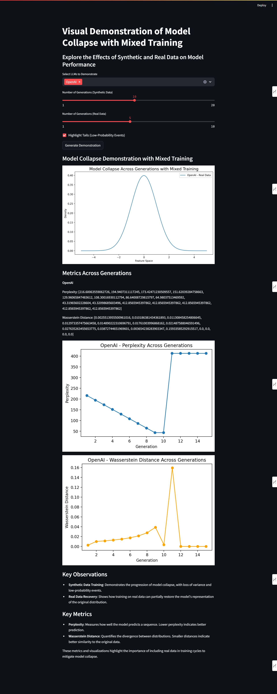

# Model Collapse Visualization with Mixed Training

This project provides an interactive visualization tool to demonstrate the effects of model collapse in Large Language Models (LLMs) and how mixed training with real data can help mitigate these effects.

The development of this Github Repository was inspired by the "THE CURSE OF RECURSION: TRAINING ON GENERATED DATA MAKES MODELS FORGET" paper. To read the full paper, visit https://arxiv.org/pdf/2305.17493



## Features

- Interactive visualization of model collapse across multiple LLMs
- Support for 7 different LLMs: OpenAI, Anthropic, Mistral, Groq, Gemini, Cohere, and Emergence
- Real-time generation of synthetic and real data distributions
- Metrics tracking:
  - Perplexity scores
  - Wasserstein distances
- Customizable parameters for number of generations and data types
- Option to highlight low-probability events (distribution tails)

## Requirements

- Python 3.11 or later
- Required packages are listed in `requirements.txt`

## Setup

1. Create a virtual environment:
```bash
python -m venv venv
```

2. Activate the virtual environment:
- Windows:
```bash
.\venv\Scripts\activate
```
- Unix/MacOS:
```bash
source venv/bin/activate
```

3. Install dependencies:
```bash
pip install -r requirements.txt
```

4. Set up environment variables in `.env` file with your LLM API keys

## Running the Application

Start the Streamlit app:
```bash
streamlit run app.py
```

## Features

1. **Model Selection**: Choose which LLMs to include in the demonstration
2. **Generation Control**: Adjust the number of synthetic and real data generations
3. **Visualization Options**: Toggle tail highlighting for better visibility of low-probability events
4. **Metrics Tracking**: Monitor perplexity and distribution divergence across generations

## Metrics Explanation

- **Perplexity**: Measures the model's prediction quality. Lower values indicate better predictions.
- **Wasserstein Distance**: Quantifies the difference between probability distributions. Smaller distances indicate better similarity to the original data.

## Project Structure

```
.
├── README.md           # This file
├── requirements.txt    # Python dependencies
├── .env               # Environment variables for LLM API keys
└── app.py             # Main Streamlit application
```

## Contributing

Feel free to submit issues and enhancement requests!
